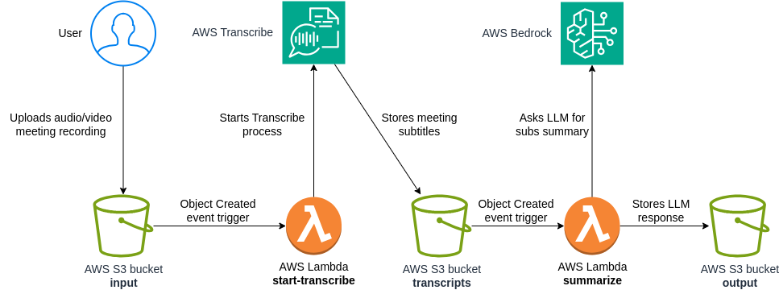

# Meeting Notes Extractor

Meeting Notes Extractor is a tool that extracts meeting notes from meeting recordings.
It leverages AWS services such as AWS Transcribe for generating meeting subtitles and AWS Bedrock for summarizing the output,
creating segments and identifying action items.

## Architecture



The architecture includes the following components:

S3 buckets:

- input bucket: where meeting recordings are uploaded
- transcript bucket: where the meeting transcript (subtitles) is stored
- output bucket: where the summary/outcome meeting notes are stored

Lambda functions:

- start_transcribe: triggers the transcription process when a new recording is uploaded
- summarize: summarizes the transcript, creates segments and identifies action items

AWS Transcribe: convert recordings (audio or video) to subtitles

AWS Bedrock: LLMs to summarize the transcript, create segments and identify action items

## Prerequisites

- docker (preferrably) or terraform installed
- gnumake (preferrably, or you can run commands from Makefile manually)
- AWS Bedrock with approved LLM model access (Claude 3 Haiku is used, but model can be changed in .env file)
- AWS S3 bucket and DynamoDB table for Terraform state and lock (see/set in terraform/config.tf)

## Deployment

Copy the `.env.dev` file to `.env` and fill in the required values.
Deployment and infrastructure are managed using Terraform.
Set your pre-prepared S3 bucket and DynamoDB table for Terraform state and lock in the config.tf file: terraform -> backend -> s3.

Run:

```bash
make init workspace apply
```

This will deploy the infrastructure.

## Usage

Upload a meeting recording to the input bucket.
Transcribe process will start automatically and will take some time (progress can be tracked in AWS console).
It will generate a transcript in the transcript bucket, which will automatically start the summarization process.
The meeting notes will be generated in the output bucket.

## Pricing

Currently (2024-07-12) AWS pricing is:

- AWS Transcribe: ~$0.0024 per minute of audio (~$1.44 per hour)
- AWS Bedrock: depends on the model used, Claude 3 Haiku is roughly $0.02 for the amount of tokens needed for 1-hour conversation.

## Plugins

The project is structured in a way that allows for easy addition of new plugins. Plugins fall into two categories:

- input plugins - responsible for uploading meeting recordings to the input bucket
- output plugins - responsible for processing transcriptions and summaries from the output bucket

To instal a plugin, navigate to its directory and run:

```bash
make apply
```

For more information, see the README in the plugin directory.

### Input plugins

- [ ] google-meet-bot - bot that joins a Google Meet call and automatically records audio. Note: this plugin probably will never be implemented (check README)
- [ ] cli - command line interface for uploading recordings
- [ ] google-drive - fetches recordings from Google Drive folder
- [ ] zoom - Zoom integration
- [ ] ms-teams - MS Teams integration

### Output plugins

- [ ] google-docs - uploads meeting notes to Google Docs
- [ ] notion - uploads meeting notes to Notion
- [ ] slack - sends meeting notes to Slack
- [ ] email - sends meeting notes via email
- [x] google-chat - sends meeting notes to Google Chat
- [ ] web-browser - displays meeting notes in a web GUI
- [ ] ai-actions - task runner for action items

## Improvement points

Current implementation is a MVP - it can be used on its own, but it would benefit greatly from any of the following:

- Web interface for uploading recordings and viewing meeting notes
- Bot that joins meetings and automatically records them
- Maybe switch remote Terraform state to local state and simplify deployment instructions
- Segments timecodes are not accurate for longer meetings
- S3 Lifecycle policy to delete old recordings
- Outbound integrations to store results in Google Docs, Notion, etc.
- Inbound integrations to fetch recordings from Google Drive, MS Teams, Dropbox, etc.
- Option to re-trigger summarization process from already transcribed recordings
- Instructions for optimal S3 uploading of large files (s5cmd)

## License

This project is licensed under the MIT License - see the [LICENSE](LICENSE) file for details.
